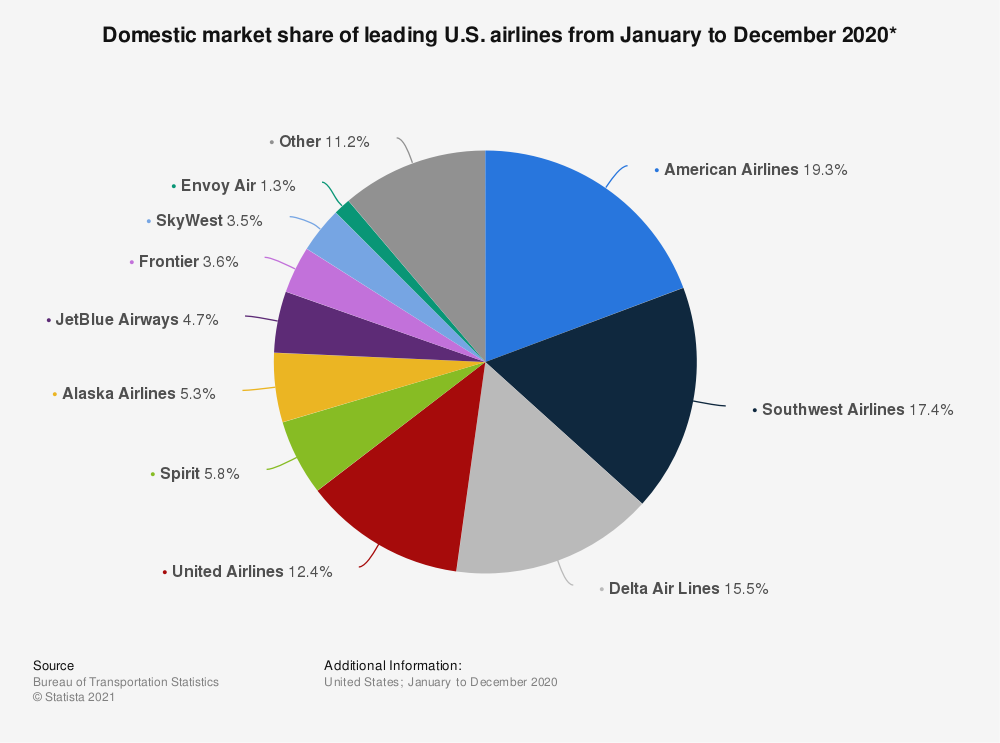

# 10K-10Q-NLP-Project

The goal of this project is to analyze the quarterly 10K/10Q reports from companies in pursuit of alpha. 

As the project stands right now, I will be more specifically looking at these reports from airlines domiciled in USA. I view the industry as a zero-sum game, which means that even the slightest sentimental difference between reports can be exploited. More information can be found here: https://medium.com/@spandey16/game-theory-and-the-airline-business-865f0a5f0f5b

To keep it brief, it is easy to imagine that a customer only needs one plane ticket for themselves, so if one airline fails to provide sufficient service at a given price, the customer will move on to another airline. Airlines run on razor-thin margins, and the Big 4 airlines (American, Southwest, Delta, and United) take up a majority of market share. Futhermore, airports only have a finite number of 'slots' in which an airline can use at a specific time, which means that if one airline loses a slot, another airline will gain. 

After analyzing the 10-K form of American Airlines in particular (see the AAL_10K_Analysis.md file), it is obvious that the industry is sensitive to external factors that it cannot control for. For example, the cost of jet fuel, or the impact of the COVID-19 pandemic. After considering the severe impact of industry beta, and the idea that the industry is a zero-sum game, it is only natural to conclude that a long/short strategy would be appropriate. We don't want to take positions in the future price of jet fuel, but we believe that a slight difference in sentiment between the management of United and American may allow for a trading opportunity (buy the slightly positive, sell the slightly negative).

Naturally, these are simply initial thoughts and are subject to change significantly throughout the lifespan of this project. 
